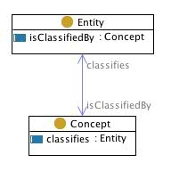

# 📚 Ontologies

## Ontology Design Patters adopted

### [Experience & Observation](http://ontologydesignpatterns.org/wiki/Submissions:Experience_%26_Observation)

| Experience & Observation - Intent                                                                                                                                                                                                                                               |
| ------------------------------------------------------------------------------------------------------------------------------------------------------------------------------------------------------------------------------------------------------------------------------- |
| to represent the epistemological "missing link" between a cognitive activity, e.g. the interaction with a cultural object, and any evidence of the effects this activity has on the individuals that are engaged with it; what can collectively be considered as an experience. |

| Experience & Observation - Domains                                                                                                                           |
| ------------------------------------------------------------------------------------------------------------------------------------------------------------ |
| [Humanities](http://ontologydesignpatterns.org/wiki/Community:Humanities), [Social Science](http://ontologydesignpatterns.org/wiki/Community:Social_Science) |

| Experience & Observation - Core CQs                                                                                                                                                                                                                                                              |
| ------------------------------------------------------------------------------------------------------------------------------------------------------------------------------------------------------------------------------------------------------------------------------------------------ |
| <ol><li>In what ways can one person be engaged in a single activity?</li><li>What personal observations were produced by reflecting upon an activity being carried out?</li><li>Which activities performed by someone have prompted an observation from that person and which haven't?</li></ol> |

Evidently, all these elements can be used to the modeling of ontologies for cognitive biases. Base OWL file for this ODP can be found [here](https://raw.githubusercontent.com/eureadit/reading-experience-ontology/master/data-model-v2.owl). Moreover, here is the diagram that the ODP uses:

<figure><figcaption>
Diagram of Experience &#x26; Observation
</figcaption></figure>

The Experience & Observation ODP has been adopted in the development of the following ontologies:

* [Picture superiority effect](picture-superiority-effect.md)
* [Self-relevance effect](self-reference-effect.md)
* [Negativity bias](negativity-bias.md)
* [Humor Effect](humor-effect.md)
* [Distinction Bias](distinction-bias.md)
* [Focusing Effect](focusing-effect.md)
* [Framing Effect ](framing-effect.md)
* [Contrast Effect](contrast-effect.md)
* [Conservatism bias](conservatism-bias.md)
* [Money illusion](money-illusion.md)
* [Weber-Fecher law](weber-fecher-law.md)

***

### [Sequence](http://ontologydesignpatterns.org/wiki/Submissions:Sequence)

| Sequence - Intent                                                                                                                                                                                                                        |
| ---------------------------------------------------------------------------------------------------------------------------------------------------------------------------------------------------------------------------------------- |
| 
To represent sequence schemas. It defines the notion of transitive and intransitive precedence and their inverses.

It can then be used between tasks, processes, time intervals, spatially locate objects, situations, etc.
 |

| Experience & Observation - Domains                                                                                                                                                                                                                                                       |
| ---------------------------------------------------------------------------------------------------------------------------------------------------------------------------------------------------------------------------------------------------------------------------------------- |
| [General](http://ontologydesignpatterns.org/wiki/Community:General), [Organization](http://ontologydesignpatterns.org/wiki/Community:Organization), [Workflow](http://ontologydesignpatterns.org/wiki/Community:Workflow), [Time](http://ontologydesignpatterns.org/wiki/Community:Time) |

| Experience & Observation - Core CQs                                                                    |
| ------------------------------------------------------------------------------------------------------ |
| <ol><li>What is before what?</li><li>What's next?</li><li>What's immediately following this?</li></ol> |



The Sequence ODP has been adopted in the development of the following ontologies:

* [Weber-Fecher law](weber-fecher-law.md)
* [Bizarreness effect](bizarreness-effect.md)
* [Humor effect](humor-effect.md)
* [Anchoring effect](anchoring-effect.md)
* [Distinction bias](distinction-bias.md)
* [Focusing effect](focusing-effect.md)

***

### [Participation](http://ontologydesignpatterns.org/wiki/Submissions:Participation)

| Participation - Intent                               |
| ---------------------------------------------------- |
| To represent participation of an object in an event. |

| Participation - Domains                                             |
| ------------------------------------------------------------------- |
| [General](http://ontologydesignpatterns.org/wiki/Community:General) |

| Participation - Core CQs                                                                                           |
| ------------------------------------------------------------------------------------------------------------------ |
| <ol><li>Which objects do participate in this event? </li><li>Which events do this object participate in?</li></ol> |

<figure><figcaption></figcaption></figure>

The Participation ODP has been adopted in the development of the following ontologies:

* [Bizarreness effect](bizarreness-effect.md)
* [Humor effect](humor-effect.md)
* [Anchoring effect](anchoring-effect.md)
* [Distinction bias](distinction-bias.md)
* [Focusing effect](focusing-effect.md)

***

### [Classification](http://ontologydesignpatterns.org/wiki/Submissions:Classification)

| Classification - Intent                                                                                                                                                                                                                                                                                                                            |
| -------------------------------------------------------------------------------------------------------------------------------------------------------------------------------------------------------------------------------------------------------------------------------------------------------------------------------------------------- |
| To represent the relations between concepts (roles, task, parameters) and entities (person, events, values), which concepts can be assigned to. To formalize the application (e.g. tagging) of informal knowledge organization systems such as lexica, thesauri, subject directories, folksonomies, etc., where concepts are first-order elements. |

| Classification - Domains                                            |
| ------------------------------------------------------------------- |
| [General](http://ontologydesignpatterns.org/wiki/Community:General) |

| Classification - Core CQs                                                                                     |
| ------------------------------------------------------------------------------------------------------------- |
| <ol><li>What concept is assigned to this entity?</li><li>Which category does this entity belong to?</li></ol> |

<figure><figcaption></figcaption></figure>

The Classification ODP has been adopted in the development of the following ontologies:

* [Bizarreness effect](bizarreness-effect.md)
* [Humor effect](humor-effect.md)

***

### [Parameter](http://ontologydesignpatterns.org/wiki/Submissions:Parameter)

| Parameter - Intent                                        |
| --------------------------------------------------------- |
| To represent parameters to be used for a certain concept. |

| Parameter - Domains                                                 |
| ------------------------------------------------------------------- |
| [General](http://ontologydesignpatterns.org/wiki/Community:General) |

<figure><figcaption></figcaption></figure>

The Classification ODP has been adopted in the development of the following ontologies:

* [Bizarreness effect](bizarreness-effect.md)
* [Humor effect](humor-effect.md)
