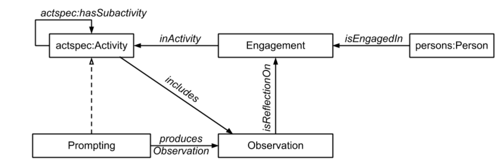

# 👴 Conservatism bias

This is the result of my work on the Conservatism bias (the final visualization was produced with the [WebVOL](http://vowl.visualdataweb.org/webvowl.html) tool), whose generic definition was generated through ChatGPT AI as follows:

> Conservatism bias is a cognitive bias that refers to the tendency of individuals to favor existing information or beliefs over new and contrary information. This bias leads people to be overly cautious when updating their beliefs or making decisions, as they tend to stick to their initial views even in the face of strong contradictory evidence.
>
> This bias can manifest in various contexts, such as financial decision-making, political beliefs, and problem-solving. People affected by conservatism bias may be hesitant to change their minds, even when presented with substantial evidence that contradicts their current beliefs.


Visualization of the bias


### Chat GPT

To review the type of questions I asked ChatGPT and the corresponding answers, I am adding the **direct link** to the conversation. In general I asked for a _definition_ of the bias, some examples of _senarios_, and a row _structure for the ontology_.


Link to the conversation


### Scenario

In this one, as in the other biases I have explored, I found the ontology proposed by the AI to be insufficient. It is an incomplete exercise that needs refinement. On the other hand, I was pleasantly surprised by the variety of scenarios presented: they were crucial for understanding this and other cognitive biases. The examples were always simple but also very effective. Here is the scenario I chose to delve into:

> <mark style="color:orange;">The Historian's Dilemma</mark>
>
> As a historian, I want to write an accurate and comprehensive account of a significant historical event, but I find myself facing the challenge of conservatism bias. Throughout my academic career, I have been deeply invested in a particular narrative about the event, which has been widely accepted by scholars for decades.
>
> Recently, new evidence and perspectives have emerged that challenge some key aspects of the established historical interpretation. As I embark on my research, I realize that I must confront my own biases and be open to reevaluating my preconceived notions.
>
> I start by reviewing the new findings and engaging in discussions with other historians who hold different viewpoints. This process is challenging because my initial reaction is to defend the traditional interpretation I have studied and taught for years. However, I recognize the importance of objectivity and the pursuit of historical truth.
>
> To overcome my conservatism bias, I decide to approach the research with a fresh perspective, treating the new evidence with the same level of scrutiny I would apply to any historical sources. I conduct thorough investigations, examining primary sources, eyewitness accounts, and other credible historical documents.
>
> As I delve deeper into the research, I start to acknowledge that some elements of the old narrative might not stand up to the weight of the newly discovered evidence. This realization prompts me to reassess my initial conclusions and consider revising my interpretation of the historical event.
>
> It becomes evident that embracing the new perspectives and updating the historical account is essential to maintain the integrity of my work and contribute to the advancement of historical knowledge. I choose to be transparent about the evolution of my interpretation, acknowledging the impact of conservatism bias on historical scholarship in my writing.
>
> In the end, I produce a more nuanced and accurate historical account that incorporates the new evidence and addresses the limitations of the previous narrative. I recognize that overcoming conservatism bias has been a challenging but rewarding journey, as it has enriched my understanding of the historical event and the complexities of human history.
>
> My revised work receives praise for its balanced approach and its willingness to embrace change, inspiring other historians to also confront their biases and continually reassess their interpretations in the pursuit of historical truth.

### Competency questions

* What influences the historian's opinion?
* What opinion does the person involved have?
* What was his action influenced by?&#x20;

### Main characteristics

The idea that I have formed studying this bias is that its peculiar characteristics can be summarized as follows:

* It always involves a **subject and an external object**.
* The subject is influenced by preexisting knowledge or interpretations.

I decided to rely on the [Experience\&Observation pattern](http://ontologydesignpatterns.org/wiki/Submissions:Experience_%26_Observation).

<figure><figcaption>
Experience&#x26;Observation pattern diagram
</figcaption></figure>

### Ontology design

This is the link to the [.owl file](https://github.com/leonardozilli/CognitiveBiasOntology/blob/main/FramingEffect.owl). Here you can find the ultimate ontology and its relative annotations.

### References

* Hilbert, Martin (2012). ["Toward a synthesis of cognitive biases: How noisy information processing can bias human decision making"](http://www.martinhilbert.net/HilbertPsychBull.pdf)
* [https://en.wikipedia.org/wiki/Conservatism\_(belief\_revision)](https://en.wikipedia.org/wiki/Conservatism_\(belief_revision\))
