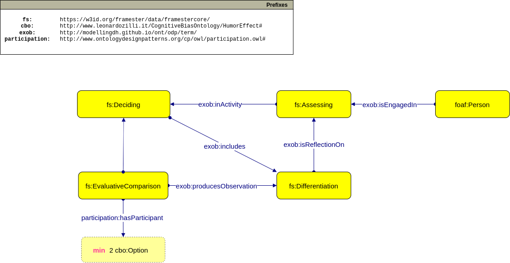

# 🍣 Distinction bias

### Visualize the ontology with [LODE](https://leonardozilli.it/CognitiveBiasOntology/lode_docs/DistinctionBias), [WebVowl](http://service.tib.eu/webvowl/#iri=http://leonardozilli.it/CognitiveBiasOntology/DistinctionBias.owl)

[**OWL File of the Ontology**](https://www.leonardozilli.it/CognitiveBiasOntology/DistinctionBias)

<figure><figcaption><p>UML of the Distinction bias ontology</p></figcaption></figure>

#### Consulted Bibliography:

These resources were consulted to compile a first understanding of the bias' behavior.

1. Hsee, Christopher & Zhang, Jiao. (2004). Distinction Bias: Misprediction and Mischoice Due to Joint Evaluation. Journal of personality and social psychology. 86. 680-95. 10.1037/0022-3514.86.5.680.

**Initial AI Ontology Prompts:**

_What is the distinction bias?_

> The distinction bias refers to a cognitive bias that occurs when people tend to emphasize the differences between two options rather than their similarities when making evaluations or comparisons. This bias can lead individuals to perceive the differences between options as more significant than they actually are, which can influence their decision-making process.

_Give me an example scenario of the distinction bias_

> In a job interview, the hiring manager is comparing two candidates for a software developer position. Candidate A has more experience but lacks expertise in a specific programming language, while candidate B has less experience but is proficient in that language. The hiring manager focuses solely on the language skill, overlooking the broader skill set of candidate A.

_Give me a short user story based on the previous scenario._

> As a hiring manager at XYZ Tech Solutions, I'm on a mission to find the ideal software developer to join our team. We have two promising candidates vying for the position, and each brings unique strengths to the table.
>
> Candidate A, with several years of experience in the software industry, has a proven track record of delivering high-quality projects. Their problem-solving skills and adaptability to new technologies make them a solid candidate. However, I noticed that they lack expertise in a specific programming language that's essential for some of our ongoing projects.
>
> On the other hand, Candidate B may have less overall experience, but they demonstrate exceptional proficiency in that very programming language we need. Their passion for learning and enthusiasm shine through, and they seem eager to take on any challenge thrown their way.
>
> As I ponder the decision, I find myself drawn to Candidate B's language skills, which are crucial for our current needs. It's easy to see their potential impact on our projects. However, I can't help but wonder if I'm overlooking the broader skill set of Candidate A. Their experience could bring valuable insights and mentorship to our team, ultimately benefiting our long-term growth.
>
> I realize that this decision is not as straightforward as it seems. I need to step back and reassess both candidates holistically. While language proficiency is vital, it shouldn't overshadow other essential qualities, like teamwork, creativity, and adaptability. I don't want to miss out on the valuable perspective and expertise that Candidate A could bring to our dynamic team.
>
> In the end, I remind myself that finding the perfect fit goes beyond technical expertise. It's about considering the long-term potential and how each candidate aligns with our company culture and values. I'll conduct another round of interviews and delve deeper into their project experiences, problem-solving abilities, and teamwork skills to make an informed decision.
>
> Ultimately, my goal is to select the candidate who will not only excel in the short term but also contribute to the growth and success of XYZ Tech Solutions in the years to come. The right choice will empower our team to achieve greater heights in the fast-paced and ever-evolving world of software development.

***

**Competency Questions:**

Q.  Who are the candidates which the hiring manager is evaluating?

```sparql
SELECT ?candidate
	WHERE { ?candidate participation:isParticipantIn fs:EvaluativeComparison }
```

***

#### Framester Frames used:

* [Deciding](https://w3id.org/framester/data/framestercore/Deciding)

> A Cognizer makes a Decision, which may be about an entity or a course of action. How (and whether) this frame is distinct from Choosing is currently up for debate. Mo decided to quit the program.

* [Assessing](https://w3id.org/framester/data/framestercore/Assessing)

> An Assessor examines a Phenomenon to figure out its Value according to some Feature of the Phenomenon. This Value is a factor in determining the acceptability of the Phenomenon. In some cases, a Method (implicitly involving an Assessor) is used to determine the Phenomenon's Value. Each company is then evaluated for their earning potential. CNI From the evidence of the pilot studies the risk of damage to the test subjects was rated too high to continue. CNI He weighed his options carefully.

* [Differentiation](https://w3id.org/framester/data/framestercore/Differentiation)

> Words in this frame have to do with a Cognizer being aware (or not being aware) of the difference between two Phenomena, which may be expressed jointly or disjointly. It is very difficult for people to visually distinguish between living and non-living things from such a great distance .

* [EvaluativeComparison](https://w3id.org/framester/data/framestercore/EvaluativeComparison)

> This frame is about the static comparison of an Profiled\_item to a Standard\_item, often with respect to some Attribute. In this frame, there is an inherent asymmetry between Profiled\_item and Standard\_item in that the two cannot be expressed jointly as a subject. Degree expressions are also found that indicate how close the items are to each other on the scale evoked by the Attribute. Furthermore, the particular value of the standard or item on a certain scale may be given by the Standard\_attribute of the Profiled\_attribute respectively. The Sun is putting on a show that rivals the most sizzling Hollywood thrillers. Mexico's Copper Canyon rivals the Grand Canyon in sheer beauty and drama. Peyton Manning's passing yards are equaled among NFL quarterbacks by only a select few. Few pianists have ever equaled the lightness and vivacity of his rhythm . The current price matches the price last year .

#### Content ODPs adopted:

* [Experience and Observation](http://ontologydesignpatterns.org/wiki/Submissions:Experience_%26_Observation)
* [Participation](http://ontologydesignpatterns.org/wiki/Submissions:Participation)
* [Sequence](http://ontologydesignpatterns.org/wiki/Submissions:Sequence)
