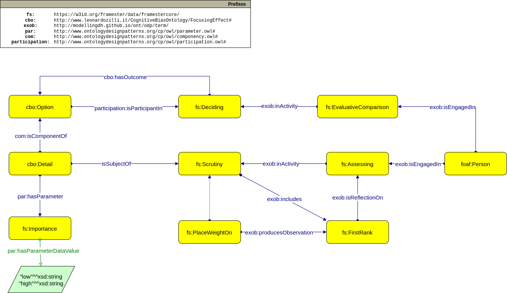

# 🔎 Focusing effect

### Visualize the ontology with [LODE](https://leonardozilli.it/CognitiveBiasOntology/lode_docs/FocusingEffect), [WebVowl](http://service.tib.eu/webvowl/#iri=http://leonardozilli.it/CognitiveBiasOntology/FocusingEffect.owl)

[**OWL File of the Ontology**](https://www.leonardozilli.it/CognitiveBiasOntology/FocusingEffect)

<figure><figcaption><p>UML of the Focusing effect ontology</p></figcaption></figure>

#### Consulted Bibliography:

These resources were consulted to compile a first understanding of the bias' behavior.

1. Krueger, Alan & Schkade, David & Schwarz, Norbert & Stone, Arthur. (2006). Would You Be Happier If You Were Richer? A Focusing Illusion. Science (New York, N.Y.). 312. 1908-10. 10.1126/science.1129688.

**Initial AI Ontology Prompts:**

_What is the focusing effect bias?_

> The focusing effect bias, also known as the focusing illusion, refers to a cognitive bias that occurs when individuals place excessive importance on a single aspect of an event or situation while neglecting other relevant factors. It involves overestimating the influence or impact of one particular factor and underestimating the importance of other variables.

_Give me an example scenario of the focusing effect bias_

> A consumer chooses a smartphone based solely on the camera quality, without considering other important features like battery life, durability, or software performance.

_Give me a short user story based on the previous scenario._

> As a passionate photography enthusiast, my smartphone plays a significant role in capturing and preserving life's precious moments. I yearn for a smartphone with an exceptional camera that can deliver high-quality images and videos. Thus, when I decide to upgrade my current device, camera quality is my primary focus.
>
> I start my search by exploring various smartphone models that boast advanced camera features and innovative photography technology. I want to find a phone that excels in low-light conditions, offers optical image stabilization, and provides manual controls for creative expression.
>
> Through research and reviews, I gather detailed information about each smartphone's camera capabilities. I'm thrilled to see some models featuring multiple lenses, AI-enhanced photography, and high-resolution sensors, which would significantly enhance my photography experience.
>
> However, I remind myself not to get lost in the allure of exceptional camera quality alone. To ensure a well-rounded choice, I broaden my perspective and consider other essential features such as battery life, durability, and software performance.
>
> A long-lasting battery is crucial, as it will enable me to capture photos and videos without worrying about frequent recharges during my photography outings. Additionally, I prioritize a durable and well-built device that can withstand my active lifestyle and occasional drops.
>
> Lastly, I acknowledge the significance of smooth performance and user-friendly software. A seamless operating system and a responsive interface will aid in quickly accessing the camera and editing tools, optimizing my photography workflow.
>
> As I compare various smartphone options side by side, I carefully weigh the trade-offs between camera quality and other features. Ultimately, I choose a smartphone that not only excels in camera performance but also aligns with my overall needs, striking the perfect balance between photographic prowess and everyday functionality. With my new smartphone, I'm now equipped to capture breathtaking images and tell visual stories like never before.

***

**Competency Questions:**

Q1.  Which features does the smartphoneB have?

```sparql
SELECT ?feature
	WHERE { ?feature a cbo:Detail ;
			com:isComponentOf ?smartphone .
			FILTER (?smartphone = cbo:smartphoneB) }
```

Q2.  Which features does the consumer care about the most?

```sparql
SELECT ?degree
	WHERE { ?feature a cbo:Detail ;
			par:hasParameter cbo:HighImportance }
```

Q3.  How important is durability to the consumer?

```sparql
SELECT ?degree
	WHERE { ?feature a cbo:Detail ;
			par:hasParameter ?importance .
		?importance par:hasParameterDataValue ?degree
		FILTER (?feature = cbo:better_durability) }
```

Q4.  Which smartphone is the consumer more likely to choose?

```sparql
SELECT ?smartphone
	WHERE { ?smartphone a cbo:DecisionOutcome }
```


***

#### Framester Frames used:

* [Deciding](https://w3id.org/framester/data/framestercore/Deciding)

> A Cognizer makes a Decision, which may be about an entity or a course of action. How (and whether) this frame is distinct from Choosing is currently up for debate. Mo decided to quit the program.

* [Assessing](https://w3id.org/framester/data/framestercore/Assessing)

> An Assessor examines a Phenomenon to figure out its Value according to some Feature of the Phenomenon. This Value is a factor in determining the acceptability of the Phenomenon. In some cases, a Method (implicitly involving an Assessor) is used to determine the Phenomenon's Value. Each company is then evaluated for their earning potential. CNI From the evidence of the pilot studies the risk of damage to the test subjects was rated too high to continue. CNI He weighed his options carefully.

* [FirstRank](https://w3id.org/framester/data/framestercore/FirstRank)

> An Item is located at the top end of a scale of importance or social rank (or some other Attribute) in comparison to other members of a Contrast\_set (usually, implicit) that is otherwise similar in kind to the Item. Oftentimes, the limits of the Contrast\_set are determined by an expression of the Limits\_of\_consideration. The main problem is that the administration has not yet clarified "Regime change." INI Oh, he had a great many concerns -- chief among them his own boredom. Their primary objective in Bosnia was bringing about a lasting peace. INI

* [EvaluativeComparison](https://w3id.org/framester/data/framestercore/EvaluativeComparison)

> This frame is about the static comparison of an Profiled\_item to a Standard\_item, often with respect to some Attribute. In this frame, there is an inherent asymmetry between Profiled\_item and Standard\_item in that the two cannot be expressed jointly as a subject. Degree expressions are also found that indicate how close the items are to each other on the scale evoked by the Attribute. Furthermore, the particular value of the standard or item on a certain scale may be given by the Standard\_attribute of the Profiled\_attribute respectively. The Sun is putting on a show that rivals the most sizzling Hollywood thrillers. Mexico's Copper Canyon rivals the Grand Canyon in sheer beauty and drama. Peyton Manning's passing yards are equaled among NFL quarterbacks by only a select few. Few pianists have ever equaled the lightness and vivacity of his rhythm . The current price matches the price last year .

* [Scrutiny](https://w3id.org/framester/data/framestercore/Scrutiny)

> This frame concerns a Cognizer (a person or other intelligent being) paying close attention to something, the Ground, in order to discover and note its salient characteristics. The Cognizer may be interested in a particular characteristic or entity, the Phenomenon, that belongs to the Ground or is contained in the Ground (or to ensure that such a property of entity is not present). Some words in this frame allow alternate expressions of the Groundand the Phenomenon: We searched the yard for my contact lens.

* [Importance](https://w3id.org/framester/data/framestercore/Importance)

> A Factor affects the outcome of an Undertaking, which can be a goal-oriented activity or the maintenance of a desirable state, the work in a Field, or something portrayed as affecting an Interested\_party. A Reason may be given for the importance of the Factor. The Degree of importance may also be specified. Temperature is the most critical factor in successful storage. Timing will be critical. Heathcliff is more important to me than myself . 1992 was of great importance to the business community.

* [PlaceWeightOn](https://w3id.org/framester/data/framestercore/PlaceWeightOn)

> An Agent who is engaged in an Undertaking accords a Degree of importance to a Consideration that influences the success of an Undertaking. As a consequence, the Agent acts in a way that reflects that judgment of importance. Our company emphasizes marketing tried and true products and services.INI In fact, most search engines place little weight on words placed in meta tags when creating their relevancy rankings.INI The emphasis is on the fundamental principles from which the automotive technologies of the future will develop, rather than on present-day processes. Our emphasis on quality does not stop with our products. INI When shooting in my studio, I emphasize a relaxed atmosphere.INI

#### Content ODPs adopted:

* [Experience and Observation](http://ontologydesignpatterns.org/wiki/Submissions:Experience_%26_Observation)
* [Participation](http://ontologydesignpatterns.org/wiki/Submissions:Participation)
* [Parameter](http://ontologydesignpatterns.org/wiki/Submissions:Parameter)
* [Sequence](http://ontologydesignpatterns.org/wiki/Submissions:Sequence)
