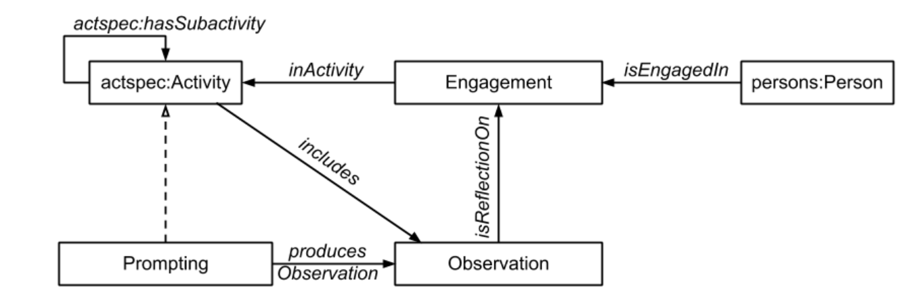

# ⚖️ Weber-Fecher law

This is the result of my work on the Weber-Fecher bias (the final visualization was produced with the [WebVOL](http://vowl.visualdataweb.org/webvowl.html) tool), whose generic definition was generated through ChatGPT AI as follows:

> The Weber-Fechner law, also known as the Weber's law or Fechner's law, is a principle in psychophysics that describes the relationship between the intensity of a physical stimulus and the psychological perception of that stimulus. It states that the subjective perception of a stimulus's magnitude is proportional to the logarithm of the stimulus intensity.
>
> In simpler terms, the law suggests that our perception of a change in stimulus intensity is not directly proportional to the actual physical change in the stimulus. Instead, the perception of change depends on the ratio of the initial stimulus intensity to the change in intensity.


Visualization of Weber-Fecher law


### ChatGPT

To review the type of questions I asked ChatGPT and the corresponding answers, I am adding the **direct link** to the conversation. In general I asked for a _definition_ of the bias, some examples of _senarios_, and a row _structure for the ontology_.


Direct link to the conversation


### Scenario

In this one, as in the other biases I have explored, I found the ontology proposed by the AI to be insufficient. It is an incomplete exercise that needs refinement. On the other hand, I was pleasantly surprised by the variety of scenarios presented: they were crucial for understanding this and other cognitive biases. The examples were always simple but also very effective. Here is the scenario I chose to delve into:

> <mark style="color:orange;">Temperature Perception - Improving Comfort</mark>
>
> As a user, I want to adjust the temperature of my air conditioning system to achieve a comfortable environment in my home.
>
> Scenario:
>
> 1. As a user, **I** set the air conditioning system to a **temperature** of 24 degrees Celsius in my room.
> 2. **Initially, the room feels slightly warm**, and I desire a cooler environment.
> 3. To perceive a noticeable change in temperature, I decrease the thermostat setting by 2 degrees **to 22 degrees Celsius**.
> 4. As the air conditioning system adjusts to the new setting and begins cooling the room, **I start to feel a significant difference in the temperature**.
> 5. The sensation of coolness becomes more pronounced as the temperature drops, providing a refreshing and comfortable environment.
> 6. **If I had initially set the air conditioning system to a lower temperature**, such as 18 degrees Celsius, **I would need to decrease the thermostat setting by a larger amount**, such as 4 degrees, to achieve a similar noticeable change in temperature.
> 7. With the Weber-Fechner law in action, I appreciate that a small adjustment in temperature settings can yield a perceptible difference when the initial temperature is relatively high.

### Competency questions

* Is the diffenerence between the two perceptions significant?
* What influences the action of lowering the air conditioner?
* What is the nature of the protagonist's physical perception? (olfactory, gustatory, etc.)

### Main characteristics

The idea that I have formed studying this bias is that its peculiar characteristics can be summarized as follows:

* It always involves an interaction between a **subject and an external object**.
* It always stems from a sensory **physical perception**.
* It develops on a **temporal plane** where t1 precedes t2. The two moments are distinguished by an **objective change in the external object**.
* As a cognitive bias, the discrepancy between the **subjective and objective dimensions** is the absolute protagonist.
* In order for the relationship between perception 1 and perception 2 to be considered significant, it must have a value x, where x is not a constant but changes according to what Weber empirically defined with a [logarithmic function.](#user-content-fn-1)[^1]

I decided to rely on the [Experience\&Observation pattern](http://ontologydesignpatterns.org/wiki/Submissions:Experience_%26_Observation) and also to use properties from [Sequence pattern](http://ontologydesignpatterns.org/wiki/Submissions:Sequence).

<figure><figcaption>
Experience&#x26;Observation pattern diagram
</figcaption></figure>

### Ontology design

This is the link to the [.owl file](https://github.com/leonardozilli/CognitiveBiasOntology/blob/main/Weber-FecherLaw.owl). Here you can find the ultimate ontology and its relative annotations.

### References

* [https://en.wikipedia.org/wiki/Weber%E2%80%93Fechner\_law](https://en.wikipedia.org/wiki/Weber%E2%80%93Fechner_law)

[^1]: [https://en.wikipedia.org/wiki/Weber%E2%80%93Fechner\_law](https://en.wikipedia.org/wiki/Weber%E2%80%93Fechner_law)
